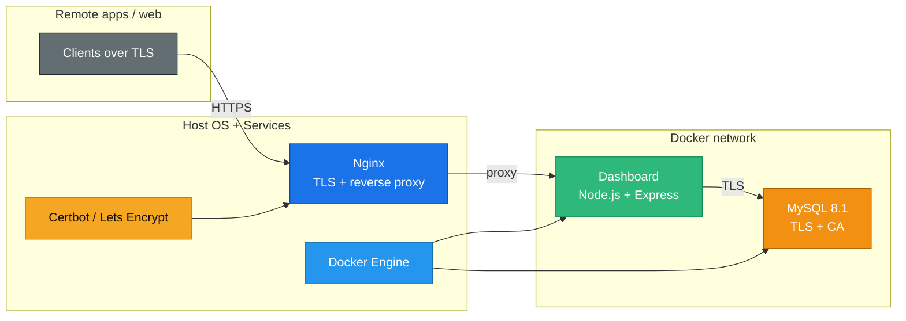

# DatabaseManager

<em>A zero-trust remote MySQL + dashboard platform that installs via Docker while leaving TLS termination and routing on the host.</em>

<table>
  <tr>
    <td align="center"> <strong>MySQL 8.1</strong> TLS-only + CA / Role-based users</td>
    <td align="center"> <strong>Docker Compose</strong> Self-healing containers</td>
    <td align="center"> <strong>Node / Express</strong> Dashboard + CSV tooling</td>
    <td align="center"> <strong>Nginx</strong> Host TLS + reverse proxy</td>
    <td align="center"> <strong>Certbot</strong> LetsEncrypt automation</td>
  </tr>
</table>

## Why it matters

- **Remote-safe data plane** – MySQL enforces `require_secure_transport`, the dashboard works only over HTTPS, and every client must trust the generated CA (`certs/mysql/ca.pem`).
- **Role-aware operations** – Superadmin / admin / user roles gate schema browsing, export/import, and SQL consoles without shipping a full DBA tool.
- **Automatic host prep** – `deploy.sh` installs Docker, Docker Compose, nginx, and certbot when missing, detects open ports, seeds secrets, and wires nginx/certbot on the host.
- **CI-friendly updates** – `intelligent-deploy.sh` pulls updates and rebuilds the containers without tampering with host services.

## Architecture

The host keeps nginx + certbot for TLS and proxying, while Docker runs the MySQL and dashboard workloads inside a dedicated bridge network (`dbnet`).

## Deployment

### 1. Prep secrets

1. Copy `.env.example` → `.env` and `dashboard/.env.example` → `dashboard/.env` if you prefer editing offline. The default files stay in `.gitignore` and must never be committed anywhere (see Security below).
2. The dashboard roles are loaded from the private `dashboard/.env` file. Keep those credentials local to the server and rotate them there instead of committing identities into source control.
3. The first run of `deploy.sh` seeds strong MySQL secrets in `.env`, syncs the dashboard database settings into `dashboard/.env`, generates private dashboard credentials, stamps a fresh build id so browsers flush stale dashboard assets, generates the CA certs, and appends `https://<DOMAIN>` to the allowed origins automatically.

### 2. First install (`sudo ./deploy.sh`)

- Run the script as root so it can install nginx, certbot, Docker, and any missing dependencies (`python3`, `curl`, etc.).
- The script asks for `DOMAIN` only if `.env` lacks a value. Once set, it reuses that domain on subsequent runs.
- It checks the preferred ports (starting at 3306 for MySQL, 8443 for the dashboard), reuses them when they already belong to this stack, and otherwise scans sequentially until it finds unused ports before writing the result back to `.env`.
- Host-level nginx is fully managed by `deploy.sh`: it boots a temporary HTTP config for ACME validation, asks certbot for a certificate without letting certbot rewrite nginx, then installs the final HTTP->HTTPS reverse-proxy config that matches the dashboard’s internal protocol.
- Docker Compose brings up MySQL (with the generated CA) and the dashboard container; `deploy.sh` rebuilds every run to keep the certs and environment aligned.

### 3. Updates (`./intelligent-deploy.sh`)

- Run without sudo.
- It verifies `DOMAIN` is populated, stamps a fresh dashboard build id to force browsers onto the latest assets, pulls image updates, rebuilds the services, and restarts the stack via `docker compose up -d --build`.
- This script assumes the host services (nginx, certbot, Docker) already exist.

## Access & Role model

- Dashboard: `https://<DOMAIN>` → log in through the SPA using the private credentials stored in `dashboard/.env`. Superadmin can import/export CSVs, run queries, and manage the full interface. Admin and user roles limit exports/imports and the SQL console.
- MySQL: Remote clients must connect using the TLS CA at `certs/mysql/ca.pem` and the private credentials defined in `.env` (`MYSQL_USER` / `MYSQL_PASSWORD`). The `MYSQL_PORT` might shift if the default was busy; consult `.env` for the active value.
- Logs: `docker compose logs mysql` and `docker compose logs dashboard` show internal output. The host logs (`/var/log/nginx/error.log`) surface TLS issues.

## Security & secrets

- **Never share `.env`, `dashboard/.env`, or the `certs/` directory on GitHub or any public storage.** Those files hold the generated MySQL and dashboard secrets and are excluded by `.gitignore` for a reason.
- Session cookies are `secure`, `httpOnly`, and `sameSite=lax`. The scripts auto-generate a strong `SESSION_SECRET`, version the dashboard assets on each deploy/update, and instruct browsers not to reuse stale cache entries.
- MySQL runs with `require_secure_transport=ON` and uses the CA in `certs/mysql`. Rotate certificates with `scripts/generate-certs.sh` and restart the stack.
- The dashboard enforces the `ALLOWED_ORIGINS` list and rejects unknown websites; every new domain is appended automatically from `deploy.sh`.

## Operations & troubleshooting

- **Ports**: Open host ports 80/443 for nginx plus the `MYSQL_PORT` from `.env` for remote apps.
- **Certificate rotation**: Run `scripts/generate-certs.sh`, then `./deploy.sh` (or `./intelligent-deploy.sh`) to rebuild containers with the new files.
- **Firewalls**: Keep the host firewall allowing nginx traffic; the dashboard endpoint and certbot challenges rely on being reachable on port 80/443.
- **Nginx errors**: Check `/var/log/nginx/error.log` for upstream TLS or proxy issues. The `deploy.sh` output tells you if the nginx config test fails.
- **Port conflicts**: `deploy.sh` detects busy ports and bumps both the MySQL and dashboard bindings until it finds a free slot, but it keeps the current ports when they are already owned by this project’s running containers.
- **Superadmin reset**: If you lose the private login, run `./scripts/reset-dashboard-superadmin.sh [username] [password]` on the server. If you omit the password, the script generates a new one, writes it only to `dashboard/.env`, bumps the build id, and rebuilds the dashboard container.

## Next steps

- Hook the dashboard into a real identity provider or Vault instead of the embedded users.
- Add monitoring alerts for the MySQL CA and dashboard certificates to refresh before expiration.
- Consider using a reverse proxy like Traefik if routing multiple domains off the same host.
