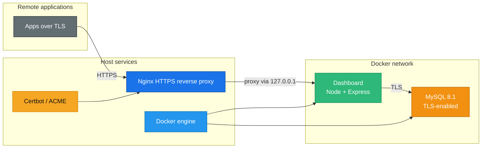

# DatabaseManager

  Deliver a hardened, TLS‑only MySQL + management dashboard that installs on any Linux host via `deploy.sh` while leaving nginx + Certbot on the host for ACME + proxying.

<table align="center">
  <tr>
    <td align="center"> <strong>MySQL 8.1</strong> TLS-only + CA &amp; role-aware users</td>
    <td align="center"> <strong>Docker Compose</strong> Self-healing containers</td>
    <td align="center"> <strong>Node / Express</strong> Dashboard + SQL import + CSV export</td>
    <td align="center"> <strong>Nginx</strong> Host TLS + reverse proxy</td>
    <td align="center"> <strong>Certbot</strong> Let’s Encrypt automation</td>
  </tr>
</table>

## Overview

- **Zero-trust data plane** – MySQL enforces `require_secure_transport=ON`, the dashboard only listens over HTTPS, and every remote client is issued the CA inside `certs/mysql/ca.pem`.
- **Multi-role dashboard** – Superadmin, admin, and regular users receive granular access to schema exploration, SQL imports, CSV exports, and custom SELECT wizards.
- **Host-driven TLS** – nginx and Certbot stay on the server so TLS, HTTP/2, and ACME challenges ride the host while the dashboard and MySQL run isolated inside Docker.
- **Guided automation** – `deploy.sh` installs missing tooling (Docker, Compose, nginx, Certbot, Python/curl), seeds secrets, boots the Docker stack, and tears down/reconfigures nginx on each run while `intelligent-deploy.sh` handles future updates.

## Architecture

## Quickstart (first run: `sudo ./deploy.sh`)

1. **Bootstrap secrets** – Scripts create `.env` and `dashboard/.env` from templates, then generate strong MySQL credentials, dashboard roles, and session secrets. The files stay in `.gitignore` for a reason; never commit them.
2. **Domain + ports** – The script only prompts for `DOMAIN` the first time; future runs reuse the value in `.env`. It also auto-detects free ports (starting from 3306 for MySQL and 8443 for the dashboard) and updates `.env` so remote clients always know the active bindings.
3. **Install host tooling** – `deploy.sh` auto-installs missing nginx, Certbot, Docker, Compose, Python, and curl before touching containers.
4. **TLS + nginx wiring** – nginx is temporarily configured to serve ACME challenges while certbot obtains certificates. Once successful, nginx is rewritten to mirror HTTPS traffic into the dashboard port via localhost.
5. **Run containers** – Docker Compose builds the MySQL container (with generated CA keys) and the dashboard. The script waits for the app to respond on `/api/status` before finishing.

## Dashboard features

- **Separate login page** – Users authenticate before reaching the dashboard; sessions are fast and refresh-blocked through build IDs.
- **Sidebar workspace** – Modern cards display metrics, import status, tables, and keyboard-friendly custom SELECT queries.
- **SQL import job tracking** – Superadmins import `.sql` dumps (maximum 2GB as limited by your host) and watch queued/running/completed/failed states in real-time.
- **Table CSV export** – Admins download selected tables at the click of a button.
- **Read-only users** – Regular users can browse schema data but cannot import or export.

## Deployment hygiene

- **intelligent-deploy.sh** – Run without `sudo`. It preserves `DOMAIN`, syncs database credentials to the dashboard env, regenerates build IDs, pulls updates, and rebuilds the stack (Docker Compose + rebuild) while leaving nginx/certbot untouched.
- **Firewalls** – Keep ports 80/443 open for nginx and the `MYSQL_PORT` from `.env` open for remote apps.
- **CA rotation** – Regenerate certificates via `scripts/generate-certs.sh` and rerun `deploy.sh` if you need new TLS material.

## Security best practices

- Never commit `.env`, `dashboard/.env`, or anything under `certs/`. They contain the generated CA, MySQL credentials, and dashboard roles.
- The dashboard aligns the allowed origin list with `DOMAIN` and rejects requests from unknown hosts.
- Sessions are `secure`, `httpOnly`, `sameSite=lax`, and expire after one hour.
- The dashboard only accepts single `SELECT` statements (no semicolons) from the query console.
- SQL imports happen through the `mysql` CLI with TLS verification, and the dashboard streams the import job status back to the UI.

## Troubleshooting

- Run `docker compose logs mysql` or `docker compose logs dashboard` for container output.
- Use `/var/log/nginx/error.log` on the host for TLS handshake or upstream errors.
- If ports shift, consult `.env` for the active `MYSQL_PORT` and `DASHBOARD_PORT`.
- Reset the superadmin credentials with `./scripts/reset-dashboard-superadmin.sh` when secrets are lost.

## Next steps

1. Swap the embedded users for your identity provider or Vault secrets.
2. Add monitoring on Certbot + CA expiry to rotate before certificates expire.
3. You can layer this stack behind an existing gateway (Traefik, HAProxy, etc.) by pointing nginx at the host ports.
